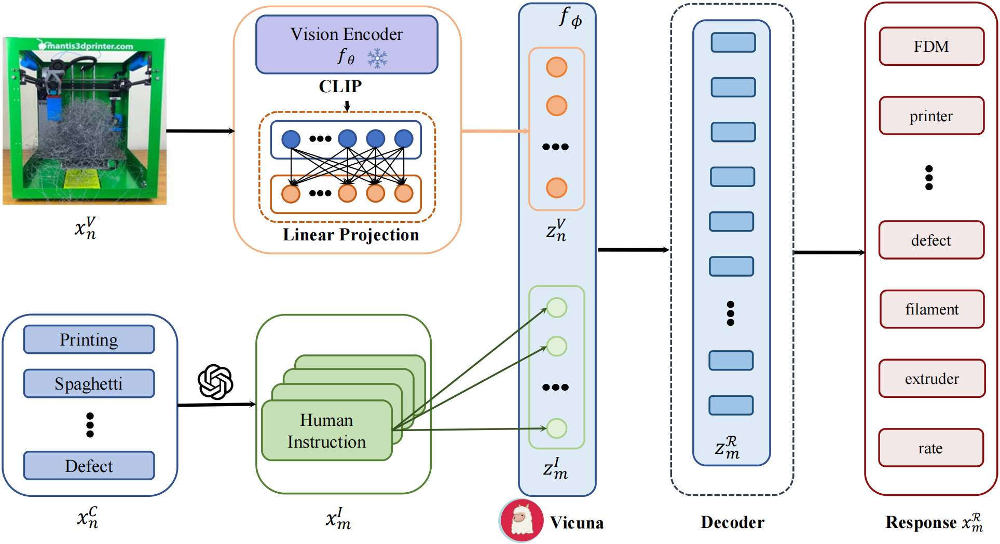
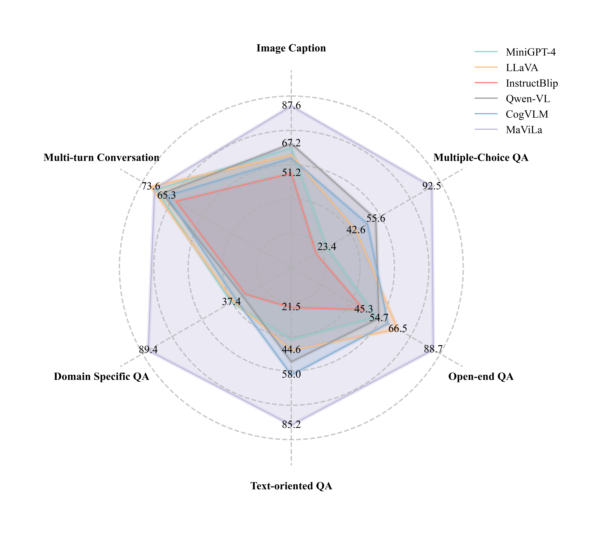

<h1 style="display: flex; align-items: center;">
  
  MaViLa: Vision Language Model for Manufacturing
</h1>

## Introduction

In this study, we focus on Visual-Language Model (VLM) training for manufacturing. Encoders are utilized to distill image and text features from $N$ image-caption pairings:

$$ \\mathcal{D} = \\left\\{x_n^V, x_m^\\mathcal{I}, x_m^\\mathcal{R}\\right\\}_{n,m=1}^{N, M} $$

### Neural Architecture

This neural architecture employs **CLIP** [Radford et al., 2021] as an image encoder, denoted as $f_\\theta$. The encoder translates images into visual features, followed by a linear projection layer, $W$, transforming visual features into visual embeddings:

$$ z_n^V = W \\cdot f_\\theta\\left(x_n^V\\right) $$

Here, $z_n^V$ represents the visual embedding.

Additionally, the text encoder $f_\\phi$ converts human instructions in $x_m^\\mathcal{I}$ into instruction embeddings. Alignment between visual and instruction embeddings generates $z_n^R$, which is then interpreted by a decoder to produce associated responses $x_n^R$.

The architecture of this network is shown in Figure 1. We employ **Vicuna** as the backbone LLM due to its superior performance in semantic understanding and human instruction-following [Zheng et al., 2023].

  

*Figure 1: The flowchart for our proposed network structure of training MaViLa.*

---

## MaViLa Performance Evaluation

### Overview

As introduced in Section 3.3, MaViLa is benchmarked against various general-purpose VLMs. Its performance is visualized in the figure below. It highlights MaViLa's expertise across tasks, with a focus on its significance in the manufacturing domain.

  

*Figure 2: MaViLa achieves state-of-the-art performance across five evaluation tasks in the manufacturing domain, though it is slightly weaker in multi-turn conversations.*

### Detailed Evaluation

MaViLa's performance, with scores out of 100, is as follows:

- **Image Captioning**: **87.6**  
  Demonstrates exceptional ability to understand, describe, and summarize visual content, crucial for manufacturing.

- **Multiple-choice QA**: **92.5**  
  Excels in selecting precise answers, reflecting deep understanding of instructions and content. While instructions may ask for the result, MaViLa often provides a complete answer resolution including the correct option.

- **Open-end QA**: **88.7**  
  Proficient in free-form answers, showcasing rich vocabulary and context awareness.

- **Text-oriented QA**: **85.2**  
  Extracts and interprets textual information from images, essential for understanding labels, instructions, and text-rich visuals in manufacturing.

- **Domain-specific QA**: **89.4**  
  Displays deep understanding of domain-specific knowledge, linking visual aspects with expert insights. Outperforms the second-best model (MiniGPT-4) by 139%, solidifying its potential as a manufacturing assistant.

- **Multi-turn Conversation**: **71.7**  
  While commendable, MaViLa exhibits limited contextual memory in multi-turn interactions, occasionally forgetting earlier references.

---

### Summary

MaViLa demonstrates state-of-the-art performance in key evaluation metrics for manufacturing applications, indicating its potential as a domain-specific expert assistant.
